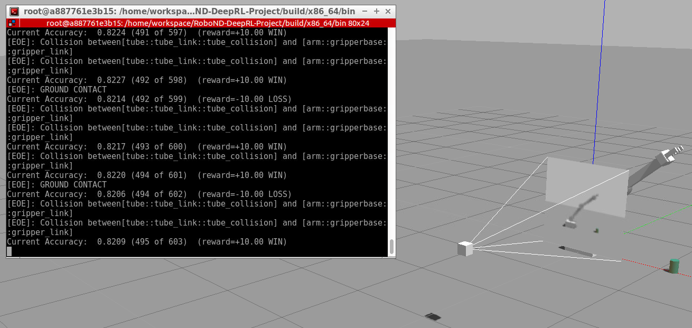

# Deep Reinforcement Learning Arm Manipulation

[](https://www.udacity.com/robotics)

[//]: # (Written by Ge Yao, 6th, April, 2019)

This project aims to create a DQN agent and define reward functions to teach a robotic arm to carry out two primary objectives:

1. Have any part of the robot arm touch the object of interest, with at least a 90% accuracy.
2. Have only the gripper base of the robot arm touch the object, with at least a 80% accuracy.

---

## Solution

To get started with the project, run the following:

``` bash
cd RoboND-DeepRL-Project/build
make
cd x86_64/bin
./gazebo-arm.sh
```

The RL agent and the reward functions are defined inside [`ArmPlugin.cpp`](gazebo/ArmPlugin.cpp).

### RL Agent:

The code segment for RL agent definition is as follows:

```c++
/*
/ Hyperparameters for DQN agent
/ Raw Input Params:
/   W-H-C: 64-64-3
/ DOF:
/   3
*/
#define INPUT_WIDTH    64
#define INPUT_HEIGHT   64
#define INPUT_CHANNELS 3

#define NUM_ACTIONS ((ArmPlugin::DOF)*2)

#define OPTIMIZER "Adam"
#define LEARNING_RATE 0.1f
#define REPLAY_MEMORY 10000
#define BATCH_SIZE 256

#define GAMMA 0.9f

#define EPS_START 0.7f
#define EPS_END 0.02f
#define EPS_DECAY 200

#define USE_LSTM true
#define LSTM_SIZE 256
#define ALLOW_RANDOM true
#define DEBUG_DQN false

// CreateAgent
bool ArmPlugin::createAgent()
{
	// Create DQN Agent:
	agent = dqnAgent::Create(
		INPUT_WIDTH, INPUT_HEIGHT, INPUT_CHANNELS, 
		NUM_ACTIONS, 
		OPTIMIZER, LEARNING_RATE, 
		REPLAY_MEMORY, BATCH_SIZE, 
		GAMMA, 
		EPS_START, EPS_END, EPS_DECAY, 
		USE_LSTM, LSTM_SIZE, 
		ALLOW_RANDOM, DEBUG_DQN
	);
}
```
The hyperparameters of the agent are determined as follows:

1. The **input dimensions** are determined from **camera message medadata**. 
2. The **output dimensions**, *NUM_ACTIONS* are set as the dimension of control. Since in this project only planar motion planning is used, hence the *LOCKBASE* is set to true and agent DOF is set as 2. So the dimension of output is set as 2*DOF which is **4**.
3. The **optimizer** is selected as **Adam** with learning rate **0.1** for LSTM out of Andrew Ng's best practice suggestion.

### Reward Function Design

After trials & errors, the final reward function is designed as follows:

```c++
/*
/ Parameters for Reward Function
*/
#define REWARD_WIN                     +10.0f
#define REWARD_LOSS                    -10.0f
#define REWARD_APPROACHING             +2.0f

#define MIN_APPROACHING_VELOCITY       +0.025f

#define FACTOR_TOUCH_BY_GRIPPER_BASE   +1.0f
#define FACTOR_TIMEOUT                 +1.0f
#define FACTOR_TOUCH_GROUND            +1.0f

#define ALPHA  0.4f
```

#### Rewards

The agent can get reward from the following two actions: **Touching object with gripper base** and **Approaching object at speed above a threshold**.

```c++
    // Reward Term 1: touching object with gripper base
    if (
        strcmp(contacts->contact(i).collision1().c_str(), COLLISION_ITEM) == 0
    ) {
        rewardHistory = REWARD_WIN;

        if (
            strcmp(contacts->contact(i).collision2().c_str(), COLLISION_GRIPPER_BASE) == 0
        ) {
            // case 1 -- touch by gripper:
            rewardHistory *= FACTOR_TOUCH_BY_GRIPPER_BASE;
        } else {
            // case others -- unwanted touch:
            rewardHistory = REWARD_LOSS;
        }

        newReward  = true;
        endEpisode = true;
    }	
```

```c++
   // moving average of approaching speed:
   avgGoalDelta  = (avgGoalDelta * ALPHA) + (distDelta * (1.0 - ALPHA));
   
   // Reward Term 2: approaching object at speed above a threshold
   float rewardGripperGoalDelta = REWARD_APPROACHING * (avgGoalDelta - MIN_APPROACHING_VELOCITY);
```

The key is the design of second part, approaching object at speed above a threshold.

#### Penalties

The agent will get penalty from the following three actions: **Touching object with parts other than gripper base**, **Time out** and **Touching the ground with gripper**.

```c++
    // Penalty Term 1: touching object with parts other than gripper base
    if (
        strcmp(contacts->contact(i).collision1().c_str(), COLLISION_ITEM) == 0
    ) {
        rewardHistory = REWARD_WIN;

        if (
            strcmp(contacts->contact(i).collision2().c_str(), COLLISION_GRIPPER_BASE) == 0
        ) {
            // case 1 -- touch by arm:
            rewardHistory *= FACTOR_TOUCH_BY_GRIPPER_BASE;
        } else {
            // case others -- unwanted touch:
            rewardHistory = REWARD_LOSS;
        }

        newReward  = true;
        endEpisode = true;
    }		
```

```c++
    // Penalty Term 2: time out
	if( maxEpisodeLength > 0 && episodeFrames > maxEpisodeLength )
	{
		printf("[EOE]: episode has exceeded %i frames\n", maxEpisodeLength);

		rewardHistory = FACTOR_TIMEOUT * REWARD_LOSS;

		newReward     = true;
		endEpisode    = true;
	}
```

```c++
    // Penalty Term 3: touching the ground with gripper
    const float goalDistance = BoxDistance(gripBBox, propBBox); 

    /*
    / TODO - set appropriate Reward for robot hitting the ground.
    */
    if(isGroundContact)
    {
        printf("[EOE]: GROUND CONTACT\n");

        rewardHistory = FACTOR_TOUCH_GROUND * REWARD_LOSS;

        newReward     = true;
        endEpisode    = true;
    }
```

---

## Results

### Approaching with Arm

Using the whole arm, the robot arm can touch the object with at larger than 90% accuracy. The full video record can be found [here](docs/videos/01-arm-touching.mp4)


### Approaching with Gripper Only.

Using only the gripper base, the robot arm can touch the object with at larger than 80% accuracy. The full video record can be found [here](docs/videos/02-gripper-grasping.mp4)


